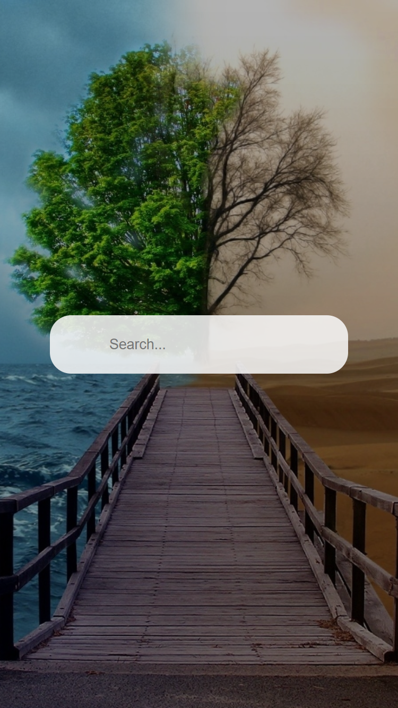
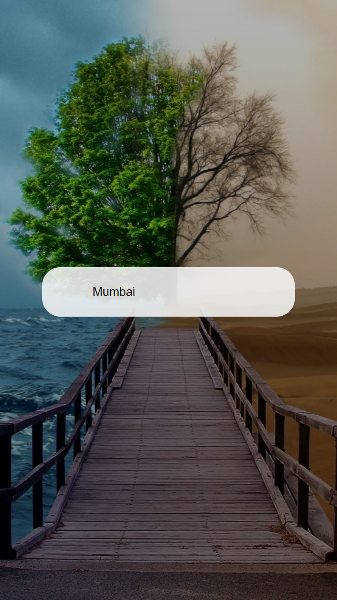
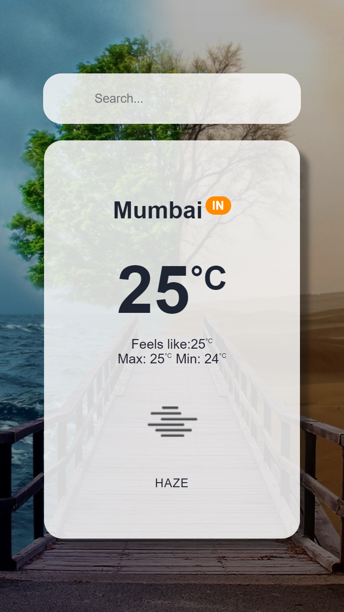
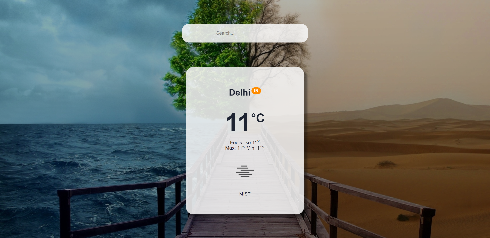
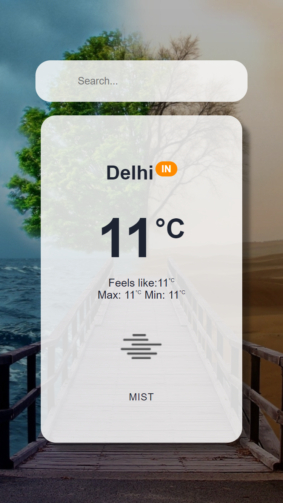

# React Weather Progressive Web App

## Table of contents

- [Overview](#overview)
  - [Demo](#demo)
  - [Screenshot](#screenshot)
  - [Links](#links)
- [My process](#my-process)
  - [Built with](#built-with)
  - [What I learned](#what-i-learned)
- [Author](#author)


## Overview

### Demo

### Screenshot










### Links

- Solution URL: [https://github.com/NandodkarAmogh/React-Weather-Progressive-Web-App](https://github.com/NandodkarAmogh/React-Weather-Progressive-Web-App)
- Live Site URL: [https://react-weatherpwa.netlify.app/](https://react-weatherpwa.netlify.app/)

## My process

### Built with

- CSS custom properties
- Flexbox
- Mobile-first workflow
- [React](https://reactjs.org/) - JS library
- [Open Weather Map API](https://openweathermap.org/api) - Weather API
- [Material UI](https://mui.com/) - For styles
### What I learned

This project helped me in revising some of the core react concepts as well as helped me to learn to build a PWA app. I learned to use React JS with service workers and to build and deploy a PWA app

```js
self.addEventListener('install', (event) => {
    event.waitUntil(
        caches.open(CACHE_NAME)
            .then((cache) => {
                console.log('Opened cache');

                return cache.addAll(urlsToCache);
            })
    )
});

// Listen for requests
self.addEventListener('fetch', (event) => {
    event.respondWith(
        caches.match(event.request)
            .then(() => {
                return fetch(event.request) 
                    .catch(() => caches.match('offline.html'))
            })
    )
});

// Activate the SW
self.addEventListener('activate', (event) => {
    const cacheWhitelist = [];
    cacheWhitelist.push(CACHE_NAME);

    event.waitUntil(
        caches.keys().then((cacheNames) => Promise.all(
            cacheNames.map((cacheName) => {
                if(!cacheWhitelist.includes(cacheName)) {
                    return caches.delete(cacheName);
                }
            })
        ))
            
    )
});
```
## Author

- Github - [@NandodkarAmogh](https://github.com/NandodkarAmogh)


